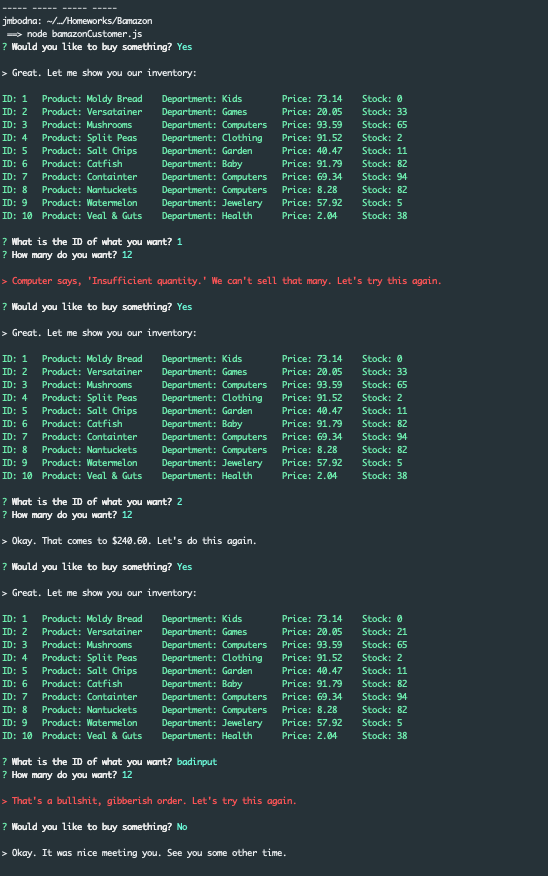

# Bamazon

A simple script/application to practice running queries with Node's [mysql](https://www.npmjs.com/package/mysql) connector. Database connection information goes in the main script, `bamazonCustomer.js`. The application uses [inquirer](https://www.npmjs.com/package/inquirer) for command line input. Use `seed.sql` to seed your `bamazon` database's `products` table.

Run the script using `node bamazonCustomer.js`.

Here's a screen shot of things in action

